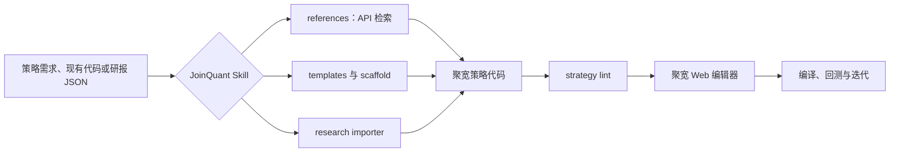
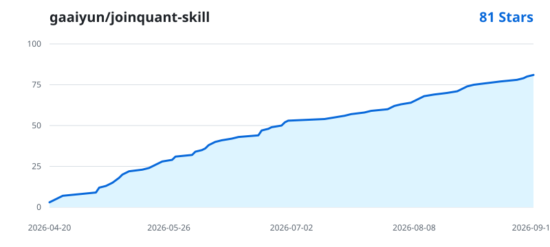

<p align="center">
  
</p>

<h1 align="center">聚宽策略助手 · JoinQuant Skill</h1>

<p align="center">让 Coding Agent 先查聚宽 API，再写策略。</p>

<p align="center">
  <a href="https://github.com/gaaiyun/joinquant-skill/actions/workflows/ci.yml"></a>
  <a href="https://www.python.org/"></a>
  <a href="references/"></a>
  <a href="templates/"></a>
  <a href="LICENSE"></a>
  <a href="https://github.com/gaaiyun/joinquant-skill/stargazers"></a>
</p>

<p align="center">
  <a href="#quick-start">快速开始</a> ·
  <a href="#能力说明">能力说明</a> ·
  <a href="#验证与使用边界">验证与边界</a> ·
  <a href="#相关项目">相关项目</a>
</p>

给 Coding Agent 使用的聚宽（JoinQuant）API 知识库、策略骨架与代码检查工具。

Cursor、Claude Code、Codex 等 coding agent 熟悉 Python，却不一定了解聚宽的运行环境和 API 约束。它们可能编造函数、混用研究与回测接口、忽略复权和交易成本，最后给出一份语法正确但无法在聚宽运行的策略。

本仓库把聚宽 API 资料、策略骨架、静态检查、因子示例、研报解析流程和 MCP 工具放在同一个 skill 中。Agent 可以按任务加载所需资料，人也可以直接使用其中的 CLI。

> [!IMPORTANT]
> 本仓库只能检查代码结构和部分聚宽用法，无法验证策略收益，也不能替代聚宽云端的编译、回测和模拟交易。`lint` 通过只说明代码没有命中当前规则；你仍需检查数据时点、交易成本、风险约束和成交条件。

## 导航

- [Quick Start](#quick-start)
- [它解决什么问题](#它解决什么问题)
- [能力说明](#能力说明)
- [常用工作流](#常用工作流)
- [安装](#安装)
- [MCP server](#mcp-server)
- [验证与使用边界](#验证与使用边界)
- [项目结构](#项目结构)
- [相关项目](#相关项目)
- [Star History](#star-history)

## Quick Start

### 1. 克隆仓库

```powershell
git clone https://github.com/gaaiyun/joinquant-skill.git
cd joinquant-skill
python --version  # 需要 Python 3.10+
```

下面的 API 搜索、策略生成和 lint 命令不需要第三方依赖。测试、`factors`、`factor_lab`、PDF 解析和 MCP 的依赖见[可选依赖](#可选依赖)。

### 2. 生成策略骨架

```powershell
python scripts/strategy_scaffold.py --list
python scripts/strategy_scaffold.py `
  --type rotation `
  --security 510300.XSHG `
  --hold-num 5 `
  --output my_strategy.py
```

### 3. 检查策略

```powershell
python scripts/strategy_lint.py my_strategy.py --strict
```

修完 error 和 warning 后，把代码粘贴到聚宽 Web 编辑器，继续做平台编译和回测。

### 4. 让 Agent 使用这个 skill

注册完成后，将需求直接交给 Agent：

```text
用 joinquant-skill 写一个 ETF 轮动策略：
标的池为 510300.XSHG、510500.XSHG、159915.XSHE，
按 20 日动量排序，每周一 09:31 调仓，最多持有 2 只。
```

Agent 会按任务读取对应模板和 reference，核对 API 后再生成代码。



详细安装步骤见 [`INSTALL_CN.md`](INSTALL_CN.md)，完整开发流程见 [`WORKFLOW.md`](WORKFLOW.md)。

## 它解决什么问题

### API 幻觉

`jqdata.get_stock_data()`、`pandas.DataFrame.diff_in_diff()` 这类函数并不存在。仓库提供按主题拆分的 reference、原始 API 资料搜索和 lint 规则，让 Agent 在生成代码前先查证。

### 运行环境混用

同一个函数在研究环境、回测环境和本地 `jqdatasdk` 中可能有不同的参数与返回结构。每份 reference 都围绕具体使用场景组织，避免把本地研究代码整段粘进聚宽策略。

### 回测细节遗漏

复权方式、数据截止时点、调度时间、手续费和滑点都会影响结果。模板给出一套可检查的起点，lint 会提示部分高频问题。它们不能证明不存在未来数据，也不会判断策略是否过拟合。

### 长文档难以进入上下文

仓库保留约 294 KB 的 API 原始资料，同时拆成 14 类 reference。Agent 只加载当前任务涉及的部分，不必把整份文档塞进 prompt。

## 能力说明

| 模块 | 用途 | 运行位置 | 验证边界 |
|---|---|---|---|
| [`references/`](references/) | 14 类聚宽 API 与运行机制说明 | Agent 上下文 / 本地阅读 | 资料会随聚宽更新而过时，关键接口需回查官方文档 |
| [`templates/`](templates/) | 5 个策略骨架：单股、多因子、ETF 轮动、动量、均值回归 | 复制到聚宽后调整 | 仅作为代码起点，尚未做收益或实盘验证 |
| [`scripts/strategy_scaffold.py`](scripts/strategy_scaffold.py) | 根据类型生成策略文件 | 本地 CLI | 只替换模板中的通用参数 |
| [`scripts/strategy_lint.py`](scripts/strategy_lint.py) | 检查已知错误、可疑 API、缺失配置和部分未来日期写法 | 本地 CLI / MCP | AST 静态检查，无法覆盖运行时数据时点和成交语义 |
| [`scripts/api_search.py`](scripts/api_search.py) | 在 `api文档/api.txt` 中搜索函数和关键词 | 本地 CLI / MCP | 原始文档排版不统一，结果需结合 reference 阅读 |
| [`factors/`](factors/) | 9 个因子示例、元数据和聚宽 native factor 映射 | 本地研究；单个函数可移植 | 优先调用官方 `jqfactor.get_factor_values`，因子 ID 需在线复验 |
| [`factor_lab/`](factor_lab/) | IC、Rank IC、衰减、分组收益和多空指标 | 本地 `jqdatasdk` 研究 | 不属于聚宽编辑器内代码 |
| [`research_importer/`](research_importer/) | PDF 文本抽取、LLM prompt、结构化 JSON 和策略候选代码生成 | 本地 CLI | 不内置 LLM；生成结果需要人工补齐未实现约束并回测 |
| [`jqskill_mcp/`](jqskill_mcp/) | 将搜索、生成和 lint 暴露为 `jq_*` MCP tools | MCP 客户端 | 工具只读，不代替聚宽账户和平台运行 |

### Reference 路由

| 任务 | Reference |
|---|---|
| 初始化、调度、费用、滑点 | [`01-strategy-setup.md`](references/01-strategy-setup.md) |
| 行情、财务、资金流、成分股 | [`02-data-getters.md`](references/02-data-getters.md) |
| `jqfactor`、Alpha101、Alpha191 | [`03-jqlib.md`](references/03-jqlib.md) |
| 标准化、中性化、因子值 | [`04-data-processing.md`](references/04-data-processing.md) |
| 组合优化、约束与权重 | [`05-portfolio-optimization.md`](references/05-portfolio-optimization.md) |
| 下单、撤单与订单查询 | [`06-trading.md`](references/06-trading.md) |
| `Order`、`Position`、`Portfolio` | [`07-objects.md`](references/07-objects.md) |
| 日志、文件、消息等工具 | [`08-misc-functions.md`](references/08-misc-functions.md) |
| 多投资组合 | [`09-multi-portfolio.md`](references/09-multi-portfolio.md) |
| Tick 策略 | [`10-tick-strategy.md`](references/10-tick-strategy.md) |
| 融资融券 | [`11-margin-trading.md`](references/11-margin-trading.md) |
| 期货 | [`12-futures.md`](references/12-futures.md) |
| 归因分析 | [`13-attribution-analysis.md`](references/13-attribution-analysis.md) |
| 撮合、复权、指标和引擎机制 | [`14-strategy-engine.md`](references/14-strategy-engine.md) |

如果不知道该读哪一份，先搜索函数名：

```powershell
python scripts/api_search.py get_price
python scripts/api_search.py --context 10 fq
python scripts/api_search.py --regex "set_\w+"
```

## 常用工作流

### 生成或改写聚宽策略

1. 写清股票池、信号、调仓频率和仓位约束。
2. 从最接近的模板开始，不要从空文件重写初始化和调度代码。
3. 用相关 reference 核对每个聚宽 API。
4. 运行 `strategy_lint.py --strict`。
5. 在聚宽编辑器编译，再做回测和结果检查。

| 策略类型 | 模板 | 适合的起点 |
|---|---|---|
| 单股票 | [`01-basic-single-stock.py`](templates/01-basic-single-stock.py) | 均线、简单择时 |
| 多因子选股 | [`02-multi-factor.py`](templates/02-multi-factor.py) | 基本面与量价因子、月度调仓 |
| ETF 轮动 | [`03-etf-rotation.py`](templates/03-etf-rotation.py) | 多资产动量排序 |
| 股票动量 | [`04-momentum-stock.py`](templates/04-momentum-stock.py) | 横截面动量 |
| 均值回归 | [`05-mean-reversion.py`](templates/05-mean-reversion.py) | Bollinger Band、RSI |

### Review 现有代码

```powershell
python scripts/strategy_lint.py path\to\strategy.py --strict
python scripts/strategy_lint.py path\to\strategy.py --json
```

重点仍需人工检查：

- 数据在信号时点是否已经发布；
- `end_date`、`count` 和当前回测时间是否一致；
- 股票、ETF、期货是否使用了对应的费用与滑点；
- 停牌、涨跌停、退市和空股票池怎样处理；
- 调仓目标是否留出费用和成交失败余量。

### 从研报生成策略候选

流水线负责整理文本、构造 prompt、读取结构化 JSON 和生成代码。LLM 调用由你完成。

```powershell
# 1. PDF → 文本
python -m research_importer extract report.pdf -o out/01_extracted_text.txt

# 2. 文本 → LLM prompt
python -m research_importer build-prompt `
  out/01_extracted_text.txt `
  --source "研报名称与日期" `
  -o out/02_llm_prompt.json

# 3. 将模型返回的 JSON 保存为 out/03_extracted.json

# 4. JSON → 聚宽策略候选代码
python -m research_importer codegen `
  out/03_extracted.json `
  -o out/strategy/
```

也可以先跑到等待 LLM 的阶段：

```powershell
python -m research_importer pipeline report.pdf -o out/
```

`codegen` 默认只接受已经映射到聚宽 native factor 或仓库内已有手算实现的因子。未知非 native 因子会直接失败，避免生成全零排序。如果只需要结构骨架，可以显式添加 `--allow-placeholders`；生成的 `NaN/TODO` 占位不能直接用于回测。

schema 中的次要因子、风险约束、手续费、滑点和置信度并不一定已经转成可执行逻辑。发布复现结果前，需要逐项对照研报原文。版权边界见 [`research_importer/disclaimer.md`](research_importer/disclaimer.md)。

完整样例位于 [`examples/case-research-replication/`](examples/case-research-replication/)。

### 本地因子研究

`factor_lab` 配合 `jqdatasdk` 使用，不应整体复制到聚宽编辑器。

```python
from jqdatasdk import auth, get_index_stocks
from factors import get as get_factor
from factor_lab import compute_ic, grouping_backtest

auth("your_jq_user", "your_jq_password")

stocks = get_index_stocks("000906.XSHG", "2024-06-30")
entry = get_factor("roe_ttm")
factor_values = entry.compute_local("2024-06-30", stocks)

# 根据多个交易日构造 factor_panel 和 forward_returns_panel 后：
ic_report = compute_ic(factor_panel, forward_returns_panel, method="spearman")
group_report = grouping_backtest(factor_panel, forward_returns_panel, n_groups=5)
```

因子映射、预处理建议和移植边界见 [`factors/USAGE.md`](factors/USAGE.md)。

## 安装

### 作为本地工具使用

```powershell
git clone https://github.com/gaaiyun/joinquant-skill.git
cd joinquant-skill
python scripts/strategy_scaffold.py --list
```

### 注册到 Cursor、Claude Code 或 Codex

Windows 用户可以让多个客户端引用同一份仓库，避免复制后版本漂移：

```powershell
cd D:\projects\joinquant-skill

$repoPath = (Get-Location).Path
$cursorSkills = Join-Path $env:USERPROFILE ".cursor\skills"
$claudeSkills = Join-Path $env:USERPROFILE ".claude\skills"
$codexBase = if ($env:CODEX_HOME) { $env:CODEX_HOME } else { Join-Path $env:USERPROFILE ".codex" }
$codexSkills = Join-Path $codexBase "skills"

New-Item -ItemType Directory -Force `
  -Path $cursorSkills, $claudeSkills, $codexSkills | Out-Null

cmd /c mklink /J "$cursorSkills\joinquant-skill" "$repoPath"
cmd /c mklink /J "$claudeSkills\joinquant-skill" "$repoPath"
cmd /c mklink /J "$codexSkills\joinquant-skill" "$repoPath"
```

如果客户端使用其他 skill 根目录，将同一仓库链接到相应目录即可。创建链接后，确认 `SKILL.md`、`references/`、`scripts/` 和 `templates/` 都能从安装位置访问；只复制根目录文件会让 skill 无法工作。

macOS、Linux 和其他安装方式见 [`INSTALL_CN.md`](INSTALL_CN.md)。

### 可选依赖

```powershell
# 测试、factors 与 factor_lab
pip install -r requirements-dev.txt

# PDF 解析（推荐）
pip install pypdfium2

# MCP server
pip install "mcp[cli]"

# 获取公开研报摘要时才需要
pip install akshare
```

不要在聚宽策略代码中执行 `pip install`。这些依赖只安装在本地工具环境。

## MCP server

安装 MCP SDK 后启动 stdio server：

```powershell
pip install "mcp[cli]"
python -m jqskill_mcp.server
```

Claude Desktop 配置示例：

```json
{
  "mcpServers": {
    "joinquant-skill": {
      "command": "python",
      "args": ["-m", "jqskill_mcp.server"],
      "cwd": "D:\\projects\\joinquant-skill"
    }
  }
}
```

`cwd` 必须指向完整仓库。如果客户端找不到 `python`，先运行 `python -c "import sys; print(sys.executable)"`，再把输出的绝对路径填入 `command`。服务会暴露 API 搜索、因子查询、策略 lint、骨架生成和研报 prompt 等 `jq_*` tools。签名与输入模型见 [`jqskill_mcp/server.py`](jqskill_mcp/server.py)。

## 验证与使用边界

### 本地测试

```powershell
python -m pytest tests -q
```

默认测试不访问外网，也不需要聚宽账号。CI 在 Python 3.10、3.11、3.12 和 3.13 上运行 pytest，并用仓库自己的 lint 检查 templates 与 examples。

### 可选在线测试

AkShare 和 `jqdatasdk` 测试默认跳过，需要显式开启：

```powershell
$env:JQSKILL_ENABLE_AKSHARE_LIVE = "1"
python -m pytest tests\test_optional_live_integrations.py -q

$env:JQSKILL_ENABLE_JQDATA_LIVE = "1"
python -m pytest tests\test_optional_live_integrations.py -q
```

第二项需要先安装并授权 `jqdatasdk`。在线测试只检查外部接口和部分因子 ID，不检查策略收益。

### 证据分层

| 层级 | 能证明什么 | 不能证明什么 |
|---|---|---|
| pytest | 仓库函数、CLI 和 mock runtime 符合测试定义 | 聚宽云端当前行为、真实网络和账户状态 |
| strategy lint | 代码没有命中已知静态规则 | 没有未来数据、没有过拟合、一定能够成交 |
| optional live tests | AkShare / `jqdatasdk` 的指定接口当前可访问 | 完整策略可在聚宽运行 |
| 聚宽编译与回测 | 指定代码和配置能够在平台执行 | 策略未来有效或适合实盘 |
| 模拟交易 / 实盘观察 | 当前市场和账户条件下的运行表现 | 长期收益保证 |

## 常见陷阱

| 陷阱 | 影响 | 检查方式 |
|---|---|---|
| 把 `use_real_price` 当作完整的未来数据防护 | 仍可能在信号时点读取尚未产生的数据 | 按 `context.current_dt` 复核每个字段，并评估 `avoid_future_data` 设置 |
| 使用固定日期判断未来数据 | 在历史回测中可能仍然前视 | 以当前回测时点为基准判断日期；电脑当天日期不适用 |
| 研究环境和回测环境共用同一段取数代码 | 参数或返回结构不一致 | 对照 [`02-data-getters.md`](references/02-data-getters.md) |
| 使用过时税费或忽略最低佣金 | 回测成本偏低或偏高 | 按资产类别和回测日期设置成本模型 |
| 模块级可变状态不用 `g.*` | 运行状态可能难以追踪 | 让 lint 检查模块变量，并人工确认生命周期 |
| 未知股票池静默回退 | 回测对象与研报不一致 | codegen 前检查 universe 和指数代码 |
| 把 placeholder 当成真实因子 | 排序结果失真 | 默认使用 fail-closed；不得直接回测 `NaN/TODO` 代码 |

## 项目结构

```text
joinquant-skill/
├── README.md                       项目入口与技术手册
├── SKILL.md                        Agent skill 路由说明
├── WORKFLOW.md                     策略、研报和因子研究工作流
├── INSTALL_CN.md                   安装与故障排查
│
├── api文档/api.txt                 聚宽 API 原始资料备份
├── references/                     14 类按需加载的 API 知识库
├── templates/                      5 个聚宽策略骨架
│
├── scripts/
│   ├── strategy_lint.py            静态检查
│   ├── strategy_scaffold.py        策略骨架生成
│   ├── api_search.py               原始 API 资料搜索
│   └── update_star_history.py      Star 历史图生成
│
├── factors/                        因子元数据、示例与 native 映射
├── factor_lab/                     本地单因子分析
├── research_importer/              研报文本到策略候选代码
├── jqskill_mcp/                    MCP server
├── examples/                       ETF、均值回归和研报案例
├── assets/                         README 明暗主题图表
├── tests/                          pytest 测试
└── .github/workflows/              CI 与 Star 图更新任务
```

## 核心约定

### 优先使用聚宽已有能力

本仓库不实现回测引擎，也不重写 `jqdatasdk`。聚宽存在 native factor 时，`factors/` 优先调用 `jqfactor.get_factor_values`；只有没有对应因子时，才考虑用行情或财务字段手算。

### 来源和环境一起记录

API 签名、数据字段和因子 ID 都可能变化。新增 reference 或示例时，应写清资料来源、适用环境和验证日期。研究环境可用不代表回测环境可用。

### 代码生成只负责第一稿

模板和 codegen 解决重复结构与常见错误。策略定义、风险约束、数据可得性和回测设计仍由使用者负责。

### 不收录付费研报正文

仓库只处理用户拥有的 PDF 或公开摘要，不保存券商付费研报。引用研究结论时应注明来源，并遵守原文授权范围。

## 相关项目

| 项目 | 适合的任务 | 本仓库与它的关系 |
|---|---|---|
| [`JoinQuant/jqdatasdk`](https://github.com/JoinQuant/jqdatasdk) | 在本地获取聚宽数据 | 作为可选数据依赖使用，不重复封装完整 SDK |
| [`JoinQuant/jqfactor_analyzer`](https://github.com/JoinQuant/jqfactor_analyzer) | 单因子分析和归因 | `factor_lab` 保持轻量，复杂分析优先参考官方工具 |
| [`stairclimber/joinquant_api`](https://github.com/stairclimber/joinquant_api) | IDE 类型提示和 API 签名 | 适合本地开发补全，本仓库侧重 Agent 路由与检查 |
| [`Oliver-whsun/jq-api-skill`](https://github.com/Oliver-whsun/jq-api-skill) | 带页码索引的 JoinQuant API 搜索 | 搜索与溯源设计值得配合使用 |
| [`marketcalls/vectorbt-backtesting-skills`](https://github.com/marketcalls/vectorbt-backtesting-skills) | VectorBT 策略和本地回测 | 平台不同，可参考其安装和验证工作流 |
| [`microsoft/qlib`](https://github.com/microsoft/qlib) | 完整 AI 量化研究平台 | 适合数据、模型和组合研究；本仓库保持 JoinQuant 专用、小范围 |

## Star History

图表每周由 GitHub Actions 使用仓库自己的 token 更新，SVG 保存在本仓库，不依赖第三方图片服务。

<picture>
  <source media="(prefers-color-scheme: dark)" srcset="assets/star-history-dark.svg">
  
</picture>

如果这个项目解决了你的聚宽代码问题，可以点一个 Star；如果遇到错误 API、过期资料或平台兼容问题，请提交可复现的 issue。

## 文档

- [`SKILL.md`](SKILL.md)：Agent 入口与 reference 路由
- [`WORKFLOW.md`](WORKFLOW.md)：完整开发步骤
- [`INSTALL_CN.md`](INSTALL_CN.md)：安装、链接和故障排查
- [`factors/USAGE.md`](factors/USAGE.md)：因子映射与环境边界
- [`research_importer/disclaimer.md`](research_importer/disclaimer.md)：研报与版权说明
- [`examples/`](examples/)：可运行案例和反例

## License

MIT，见 [`LICENSE`](LICENSE)。

## Credits

- [聚宽 API 文档](https://www.joinquant.com/help/api/help)
- [JoinQuant/jqdatasdk](https://github.com/JoinQuant/jqdatasdk)
- [JoinQuant/jqfactor_analyzer](https://github.com/JoinQuant/jqfactor_analyzer)
- [stairclimber/joinquant_api](https://github.com/stairclimber/joinquant_api)
- [obra/superpowers](https://github.com/obra/superpowers) 的 progressive disclosure 思路
